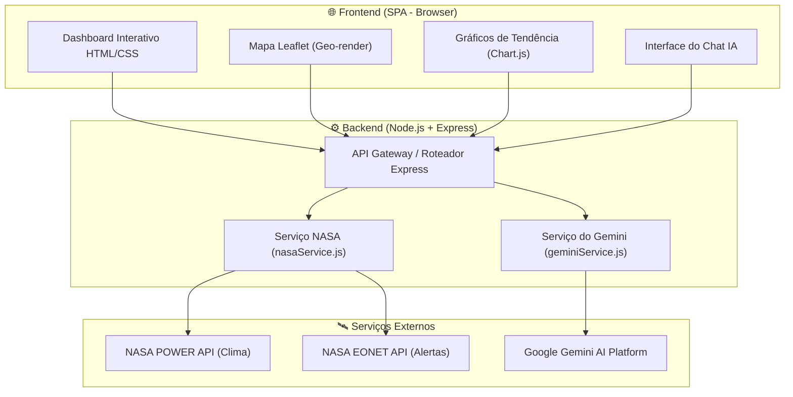

# 🌱 AgroSat — Monitoramento Agrícola com Dados de Satélite e IA Generativa

O **AgroSat** é uma solução digital inovadora voltada para agricultores, cooperativas e profissionais do agronegócio. O aplicativo combina dados agroclimatológicos em tempo real obtidos diretamente de satélites da NASA com o poder de inteligência artificial generativa (Google Gemini) para oferecer análises preditivas, monitoramento de saúde vegetal e alertas de desastres naturais.

Esta solução está diretamente alinhada com o **ODS 2 da ONU (Fome Zero e Agricultura Sustentável)**, promovendo práticas agrícolas mais eficientes, resilientes e sustentáveis.

---

## 📋 Sumário

1. [Sobre o Projeto](#-sobre-o-projeto)
2. [Alinhamento com ODS 2](#-alinhamento-com-ods-2)
3. [Principais Funcionalidades](#-principais-funcionalidades)
4. [Tecnologias Utilizadas](#-tecnologias-utilizadas)
5. [Arquitetura da Solução](#-arquitetura-da-solucao)
6. [Estrutura do Projeto](#-estrutura-do-projeto)
7. [Configuração do Ambiente](#%EF%B8%8F-configuracao-do-ambiente)
8. [Como Executar](#-como-executar)
9. [Endpoints da API](#-endpoints-da-api)
10. [Desenvolvedores (Integrantes)](#-desenvolvedores-integrantes)
11. [Vídeo Demonstrativo](#-video-demonstrativo)

---

## 🛰️ Sobre o Projeto

O AgroSat foi desenvolvido para democratizar o acesso a informações espaciais e climáticas complexas para pequenos e médios produtores. Integrando a **NASA POWER API** (para dados agroclimáticos diários) e a **NASA EONET API** (para monitoramento de eventos naturais extremos como secas, incêndios e inundações), o sistema calcula estimativas de índices de vegetação (como o NDVI) e provê um assistente virtual inteligente baseado no modelo **Gemini 2.5 Flash** para interpretar esses indicadores em português claro e sugerir ações de manejo do solo, irrigação e colheita.

---

## 🌾 Alinhamento com ODS 2

O projeto visa contribuir para a erradicação da fome e a promoção da agricultura sustentável através das seguintes frentes:
- **Resiliência a Mudanças Climáticas:** Alertas de desastres naturais em tempo real (EONET) permitem que os agricultores se preparem para eventos severos, minimizando a perda de safras.
- **Eficiência de Recursos:** Ao sugerir quando irrigar com base em dados de umidade, temperatura e radiação solar, reduz o desperdício de água e insumos.
- **Aumento da Produtividade:** Sugestões personalizadas da IA para rotação de culturas, preparo de solo e datas ideais de plantio com base em dados históricos e atuais dos últimos 30 dias de satélite.

---

## ✨ Principais Funcionalidades

- **Dashboard de Métricas Agroclimáticas:** Exibição da temperatura média (com máximas e mínimas), precipitação total, umidade relativa e radiação solar média diária acumulada nos últimos 30 dias da localização selecionada.
- **Estimativa de NDVI (Saúde Vegetal):** Cálculo automatizado de um score de vegetação (-1 a 1) baseado em fatores climáticos locais com feedback visual da saúde da lavoura.
- **Mapa Interativo Leaflet (Dark Mode):** Exibição espacializada de alertas globais de desastres naturais ativos (secas, incêndios, enchentes, tempestades) no mapa.
- **Gráficos de Tendência (Chart.js):** Gráficos dinâmicos e interativos de temperatura e precipitação dos últimos 30 dias para análise de sazonalidade.
- **Assistente IA AgroSat:** Um chat inteligente integrado com o Google Gemini. O assistente recebe automaticamente o contexto da localização buscada (dados de satélite, alertas ativos e NDVI) permitindo responder a perguntas como "Quando devo irrigar?" ou "Há risco de seca?" de maneira contextualizada.

---

## 🛠️ Tecnologias Utilizadas

### Backend
- **Node.js** com **Express** (arquitetura ESM)
- **@google/genai** (SDK oficial do Google Gemini AI)
- **dotenv** (gerenciamento de variáveis de ambiente de forma segura)
- **cors** (controle de acesso HTTP)

### Frontend
- **HTML5** & **CSS3** (Design System premium customizado, Glassmorphism, animações e responsivo para celulares e desktops)
- **JavaScript (Vanilla / ES6)** (Lógica SPA modularizada)
- **Leaflet.js** via CDN (Visualização geográfica e renderização de mapas interativos)
- **Chart.js** via CDN (Geração de gráficos de linha e barra para tendências)
- **Lucide Icons** & **Google Fonts (Inter / Outfit)**

### APIs de Satélite & IA
- **NASA POWER API** (Agroclimatology Daily Point API)
- **NASA EONET API v3** (The Earth Observatory Natural Event Tracker)
- **Google Gemini API** (`gemini-2.5-flash`)

---

## 📐 Arquitetura da Solução

O fluxo de dados da aplicação funciona de acordo com o diagrama abaixo:



---

## 📁 Estrutura do Projeto

```
AgroSat-IoT/
├── server/
│   ├── index.js              # Inicializador do Express Server
│   ├── db/
│   │   └── schema.sql        # Script DDL do banco Oracle
│   ├── routes/
│   │   ├── nasa.js           # Endpoints de clima, histórico e NDVI
│   │   ├── ai.js             # Endpoints do assistente IA
│   │   └── iot.js            # Endpoints do simulador de sensores IoT
│   └── services/
│       ├── geminiService.js   # Integração com a API do Google Gemini
│       ├── nasaService.js     # Integração com as APIs da NASA
│       └── dbService.js       # Conexão e queries com o Oracle Database
├── public/
│   ├── index.html             # Interface SPA (Single Page Application)
│   ├── css/
│   │   └── style.css          # Design System completo e responsivo
│   └── js/
│       ├── app.js             # Inicialização e estado global do frontend
│       ├── dashboard.js       # Atualização dos cards de estatísticas
│       ├── map.js             # Manipulação do mapa Leaflet e alertas EONET
│       ├── charts.js          # Gráficos dinâmicos do histórico climático
│       ├── chat.js            # Comunicação com a rota da IA e interface do chat
│       └── iot.js             # Lógica de envio do IoT e do histórico Oracle
├── package.json               # Gerenciamento de scripts e dependências NPM
├── .env.example               # Exemplo de variáveis de ambiente
├── .gitignore                 # Arquivos ignorados pelo Git (node_modules, .env)
└── README.md                  # Documentação do projeto (este arquivo)
```

---

## ⚙️ Configuração do Ambiente

1. Clone o repositório ou navegue até o diretório do projeto:
   ```bash
   cd AgroSat-IoT
   ```

2. Crie o arquivo `.env` na raiz do projeto baseado no `.env.example`:
   ```bash
   cp .env.example .env
   ```

3. Abra o arquivo `.env` e configure sua API Key do Google Gemini e suas credenciais do banco de dados Oracle:
   ```env
   # Google Gemini API Key
   GEMINI_API_KEY=sua_chave_real_da_api_aqui
   PORT=3000

   # Conexão Oracle Database
   DB_USER=rm561055
   DB_PASSWORD=sua_senha_do_banco_aqui
   DB_HOST=oracle.fiap.com.br
   DB_PORT=1521
   DB_SID=orcl
   ```

---

## 🚀 Como Executar

### Pré-requisitos
- Node.js instalado (versão 18 ou superior recomendada)
- Gerenciador de pacotes npm

### Passos para Inicialização
1. Instale as dependências do projeto:
   ```bash
   npm install
   ```

2. Inicie o servidor em modo de desenvolvimento (reinicia automaticamente ao alterar arquivos):
   ```bash
   npm run dev
   ```

3. Acesse a aplicação no seu navegador em:
   ```
   http://localhost:3000
   ```

---

## 📡 Endpoints da API

O servidor Express disponibiliza os seguintes endpoints de backend:

### 1. Clima da Região (NASA POWER)
- **Rota:** `GET /api/nasa/climate`
- **Query Params:** `lat` (latitude) e `lon` (longitude)
- **Resposta:** Sumário de médias e dados climáticos diários dos últimos 30 dias.

### 2. Alertas de Desastres Globais (NASA EONET)
- **Rota:** `GET /api/nasa/events`
- **Query Params:** `days` (limite de dias anteriores, padrão 60)
- **Resposta:** Lista de eventos naturais ativos de tempestades, secas, incêndios e inundações pelo mundo.

### 3. Estimativa de NDVI (Com gravação automática no banco)
- **Rota:** `GET /api/nasa/ndvi`
- **Query Params:** `lat` e `lon`
- **Resposta:** Cálculo do NDVI com descrição e classificação. Além disso, **salva automaticamente** o registro da busca na tabela `TB_AGRO_BUSCA` do Oracle Database.

### 4. Histórico de Pesquisas (OracleDB)
- **Rota:** `GET /api/nasa/history`
- **Query Params:** `limit` (opcional, padrão 10)
- **Resposta:** Lista das últimas coordenadas buscadas e seus scores salvos no banco.

### 5. Chat com o Assistente de IA (Gemini + Contexto Satélite & IoT)
- **Rota:** `POST /api/ai/chat`
- **Body JSON:**
  ```json
  {
    "message": "Qual é a recomendação para a minha lavoura?",
    "location": { "lat": -23.55, "lon": -46.63 },
    "climateData": { ... },
    "ndviData": { ... },
    "events": [ ... ],
    "sensorData": { "umidade_solo": 50, "temperatura_ar": 25, "ph_solo": 6.5 },
    "history": [ ... ]
  }
  ```
- **Resposta:** Diagnóstico contextualizado e conselhos agrícolas gerados pela IA do Gemini. A conversa também é **salva automaticamente** na tabela `TB_AGRO_CHAT` do Oracle.

### 6. Enviar Telemetria IoT
- **Rota:** `POST /api/iot/readings`
- **Body JSON:**
  ```json
  {
    "latitude": -23.55,
    "longitude": -46.63,
    "umidade_solo": 62.5,
    "temperatura_ar": 23.8,
    "ph_solo": 6.2
  }
  ```
- **Resposta:** Confirmação de gravação bem-sucedida na tabela `TB_AGRO_SENSOR_IOT` do Oracle.

### 7. Histórico de Leituras de Sensores IoT
- **Rota:** `GET /api/iot/readings`
- **Query Params:** `limit` (opcional, padrão 15)
- **Resposta:** Histórico de telemetrias enviadas pelos sensores.

---

## ☁️ Cloud Computing (Guia de Deploy)

Para cumprir o requisito de **Cloud Computing**, você pode fazer o deploy gratuito desta aplicação no **Render** (para o backend Node.js) ou na **Vercel** (para o frontend estático, embora o Render simplifique o deploy do projeto fullstack completo).

### Passos para Deploy no Render (Recomendado):
1. Crie uma conta gratuita em [Render](https://render.com).
2. Conecte sua conta do GitHub e selecione o repositório público do seu projeto.
3. Crie um novo **Web Service**.
4. Configure as seguintes opções:
   - **Runtime:** `Node`
   - **Build Command:** `npm install`
   - **Start Command:** `npm start`
5. Vá na aba **Environment** (Variáveis de Ambiente) e configure as variáveis que estão no arquivo `.env`:
   - `GEMINI_API_KEY`: Sua chave de acesso do Gemini.
   - `DB_USER`: `rm561055`
   - `DB_PASSWORD`: Sua senha do banco da FIAP.
   - `DB_HOST`: `oracle.fiap.com.br`
   - `DB_PORT`: `1521`
   - `DB_SID`: `orcl`
6. Clique em **Deploy Web Service**. O Render gerará uma URL pública (ex: `https://agrosat-iot.onrender.com`) onde a aplicação ficará ativa na nuvem!

---

## 👨‍💻 Desenvolvedores (Integrantes)

- **Gustavo Dantas** - RM: 560685
- **Gustavo Ramos** - RM: 561055
- **Davi Vasconcelos** - RM: 559906
- **Arthur Henrique** - RM: 560820

---

## 🎥 Vídeo Demonstrativo

👉 [Link do Vídeo no YouTube (Placeholder)](https://youtube.com)
