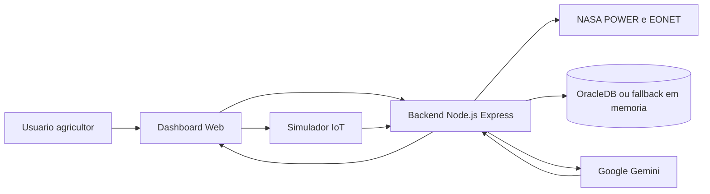

# Conformidade Global Solution - AgroSat IoT

Este documento organiza a aderencia do projeto aos requisitos da atividade e serve como guia para a entrega no Portal e para a apresentacao presencial.

## Trilha escolhida

**IA Generativa**

O AgroSat IoT usa o Google Gemini como assistente agricola contextual. A IA recebe dados de satelite da NASA, estimativa de NDVI, alertas naturais, telemetria IoT simulada e historico da conversa para gerar recomendacoes em linguagem natural.

## Matriz de requisitos

| Requisito | Como o projeto atende | Evidencia no repositorio |
| --- | --- | --- |
| Solucao funcional com IA aplicada a problema real | Monitoramento agricola para apoiar manejo, irrigacao e resposta a riscos climaticos | `public/index.html`, `server/routes/ai.js`, `server/services/geminiService.js` |
| Tema Global Solution e integracao com outras disciplinas | ODS 2, agricultura sustentavel, dados climaticos, IoT, banco de dados e dashboard | `README.md`, `server/db/schema.sql` |
| IA Generativa com interface interativa | Chat AgroSat AI com contexto agricola e historico de conversa | `public/js/chat.js`, `server/routes/ai.js` |
| Processamento contextual das informacoes | Prompt inclui localizacao, clima, NDVI, alertas EONET e telemetria de sensores | `server/services/geminiService.js` |
| Dados e APIs | NASA POWER para clima e NASA EONET para desastres naturais | `server/services/nasaService.js` |
| Automacao | Busca automatica de clima/NDVI ao selecionar localizacao; salvamento automatico de buscas e conversas | `public/js/app.js`, `server/routes/nasa.js`, `server/routes/ai.js` |
| Banco de dados | OracleDB com tabelas de buscas, sensores IoT e conversas com IA | `server/db/schema.sql`, `server/services/dbService.js` |
| Dashboard/interface analitica | Cards de metricas, grafico de tendencias, mapa de alertas, historico e chat | `public/index.html`, `public/js/dashboard.js`, `public/js/charts.js`, `public/js/map.js` |
| Cloud computing | Guia de deploy no Render documentado | `README.md` |
| Documentacao e arquitetura | README com arquitetura Mermaid, endpoints e execucao | `README.md` |

## Fluxo da solucao

## Checklist antes de enviar no Portal

- [ ] Criar um repositorio publico no GitHub e subir o codigo.
- [ ] Confirmar que `.env` nao foi enviado ao GitHub.
- [ ] Preencher os integrantes reais no `README.md`.
- [ ] Gravar video de ate 3 minutos e publicar no YouTube como "nao listado".
- [ ] Substituir o placeholder do link do video no `README.md`.
- [ ] Testar `npm install` e `npm start` em uma pasta limpa.
- [ ] Executar a aplicacao em `http://localhost:3000`.
- [ ] Demonstrar uma busca por coordenadas, por exemplo `-23.55, -46.63`.
- [ ] Enviar uma telemetria IoT simulada.
- [ ] Fazer uma pergunta ao chat, por exemplo: "Quando devo irrigar minha plantacao?"
- [ ] Mostrar o historico gravado ou o fallback em memoria caso o Oracle esteja indisponivel.

