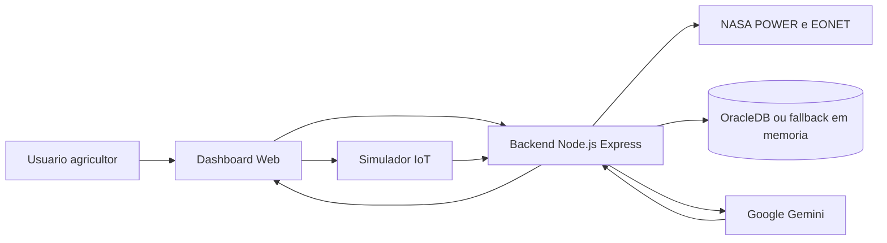

# Conformidade Global Solution - AgroSat IoT

Este documento organiza a aderencia do projeto aos requisitos da atividade e serve como guia para a entrega no Portal e para a apresentacao presencial.

## Trilha escolhida

**IA Generativa**

O AgroSat IoT usa o Google Gemini como assistente agricola contextual. A IA recebe dados de satelite da NASA, estimativa de NDVI, alertas naturais, telemetria IoT simulada e historico da conversa para gerar recomendacoes em linguagem natural.

## Matriz de requisitos

| Requisito | Como o projeto atende | Evidencia no repositorio |
| --- | --- | --- |
| Solucao funcional com IA aplicada a problema real | Monitoramento agricola para apoiar manejo, irrigacao e resposta a riscos climaticos | `public/index.html`, `server/routes/ai.js`, `server/services/geminiService.js` |
| Tema Global Solution e integracao com outras disciplinas | ODS 2, agricultura sustentavel, dados climaticos, IoT, banco de dados e dashboard | `README.md`, `server/db/schema.sql` |
| IA Generativa com interface interativa | Chat AgroSat AI com contexto agricola e historico de conversa | `public/js/chat.js`, `server/routes/ai.js` |
| Processamento contextual das informacoes | Prompt inclui localizacao, clima, NDVI, alertas EONET e telemetria de sensores | `server/services/geminiService.js` |
| Dados e APIs | NASA POWER para clima e NASA EONET para desastres naturais | `server/services/nasaService.js` |
| Automacao | Busca automatica de clima/NDVI ao selecionar localizacao; salvamento automatico de buscas e conversas | `public/js/app.js`, `server/routes/nasa.js`, `server/routes/ai.js` |
| Banco de dados | OracleDB com tabelas de buscas, sensores IoT e conversas com IA | `server/db/schema.sql`, `server/services/dbService.js` |
| Dashboard/interface analitica | Cards de metricas, grafico de tendencias, mapa de alertas, historico e chat | `public/index.html`, `public/js/dashboard.js`, `public/js/charts.js`, `public/js/map.js` |
| Cloud computing | Guia de deploy no Render documentado | `README.md` |
| Documentacao e arquitetura | README com arquitetura Mermaid, endpoints e execucao | `README.md` |

## Fluxo da solucao

## Checklist antes de enviar no Portal

- [ ] Criar um repositorio publico no GitHub e subir o codigo.
- [ ] Confirmar que `.env` nao foi enviado ao GitHub.
- [ ] Preencher os integrantes reais no `README.md`.
- [ ] Gravar video de ate 3 minutos e publicar no YouTube como "nao listado".
- [ ] Substituir o placeholder do link do video no `README.md`.
- [ ] Testar `npm install` e `npm start` em uma pasta limpa.
- [ ] Executar a aplicacao em `http://localhost:3000`.
- [ ] Demonstrar uma busca por coordenadas, por exemplo `-23.55, -46.63`.
- [ ] Enviar uma telemetria IoT simulada.
- [ ] Fazer uma pergunta ao chat, por exemplo: "Quando devo irrigar minha plantacao?"
- [ ] Mostrar o historico gravado ou o fallback em memoria caso o Oracle esteja indisponivel.

## Roteiro sugerido para o video de ate 3 minutos

1. **0:00-0:20 - Problema e proposta**
   Apresentar o AgroSat IoT como solucao para apoiar pequenos e medios produtores com dados climaticos, satelite e IA.

2. **0:20-0:55 - Dashboard**
   Mostrar a busca por coordenadas, os cards climaticos, o NDVI estimado e os graficos.

3. **0:55-1:25 - APIs e alertas**
   Mostrar o mapa com alertas EONET e explicar que os dados vem das APIs da NASA.

4. **1:25-1:55 - IoT e banco**
   Enviar uma telemetria simulada de umidade, temperatura e pH. Explicar que o projeto grava no OracleDB e possui fallback em memoria para demo.

5. **1:55-2:35 - IA Generativa**
   Abrir o chat e perguntar algo pratico. Explicar que o Gemini recebe clima, NDVI, alertas e sensores como contexto.

6. **2:35-3:00 - Arquitetura e resultado**
   Mostrar rapidamente o diagrama no README e fechar destacando ODS 2, agricultura sustentavel e proximos passos.

## Pontos para a apresentacao presencial

- Um integrante pode explicar o problema, ODS 2 e publico alvo.
- Um integrante pode explicar o frontend: dashboard, mapa, graficos e chat.
- Um integrante pode explicar o backend: Express, rotas e integracoes NASA/Gemini.
- Um integrante pode explicar o banco: tabelas Oracle e fallback em memoria.
- Um integrante pode explicar deploy/cloud e seguranca de variaveis no `.env`.

## Perguntas tecnicas provaveis

**Qual trilha foi escolhida?**
IA Generativa, pois a principal inteligencia do sistema e o assistente agricola com Google Gemini usando contexto operacional.

**Quais dados entram no prompt da IA?**
Mensagem do usuario, localizacao, resumo climatico da NASA POWER, NDVI estimado, alertas EONET, telemetria IoT simulada e historico recente do chat.

**O projeto depende do Oracle para funcionar?**
Nao. Ele tenta usar OracleDB quando as credenciais estao configuradas, mas usa fallback em memoria para permitir demonstracao funcional mesmo sem conexao.

**Onde esta o banco de dados?**
O DDL esta em `server/db/schema.sql`, com tabelas para buscas, sensores IoT e conversas com IA.

**Como a solucao usa cloud computing?**
O README descreve deploy no Render como Web Service Node.js, usando variaveis de ambiente para chaves e credenciais.
